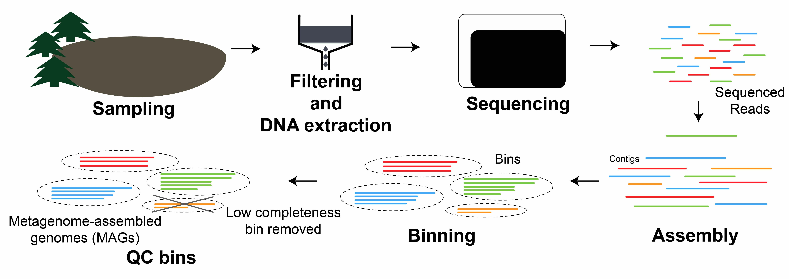

## Fourth Year Committee Report
Sarah Stevens, McMahon Lab  
Meeting: October 26th, 2017 in MSB 5503  

I am interested in understanding how bacterial populations diversify and form species.
My work aims to better understand the forces that shape bacterial population structure using the lakes as a model system.
The McMahon Lab metagenomic time series of many lakes is an ideal dataset for investigating how wild bacterial populations change through time.

### Research Progress

#### Abstract for Accepted Manuscript (ISMEJ)
To understand the forces driving differentiation and diversification in wild bacterial populations, we must be able to delineate and track ecologically relevant units through space and time. Mapping metagenomic sequences to reference genomes derived from the same environment can reveal genetic heterogeneity within populations, and in some cases, be used to identify boundaries between genetically similar, but ecologically distinct, populations. Here we examine population-level heterogeneity within abundant and ubiquitous freshwater bacterial groups such as the acI Actinobacteria and LD12 Alphaproteobacteria (the freshwater sister clade to the marine SAR11) using 33 single cell genomes and a 5-year metagenomic time series. The single cell genomes grouped into 15 monophyletic clusters (termed “tribes”) that share at least 97.9% 16S rRNA identity. Distinct populations were identified within most tribes based on the patterns of metagenomic read recruitments to single-cell genomes representing these tribes. Genetically distinct populations within tribes of the acI actinobacterial lineage living in the same lake had different seasonal abundance patterns, suggesting these populations were also ecologically distinct. In contrast, sympatric LD12 populations were less genetically differentiated. This suggests that within one lake, some freshwater lineages harbor genetically discrete (but still closely related) and ecologically distinct populations, while other lineages are composed of less differentiated populations with overlapping niches. Our results point at an interplay of evolutionary and ecological forces acting on these communities that can be observed in real time.

#### Current Project

I have been working on binnning genomes from Crystal Bog and Mary Lake over the past year.
One of my current challenges is de-replicating these bins, since we likely have recovered the same genomes from multiple timepoints.  Additionally I am working on methods to classify them, as past methods did not scale up.
I will also bin additional genomes from Trout Bog using new assemblies of the individual time points.
The previously binned genomes from TB were done on a coassembly of all of the timepoints.  
Binning and assembling each sample separately provides several advantages which I hope will help to recover more MAG reference genomes.
One such advantage is the lower strain heterogeneity in individual samples which can interfere with assembly.
Individual assemblies can also better recover genomes from bacteria that were only abundant in one sample but might have been relatively rare in the coassembly which can make assembly difficult.
Additionally I hope to be able to recover more of the flexible genome by assembling the same organism in different timepoints.

*Questions: Are there ecologically distinct strains/genotypes within previously defined sequence-discrete populations?  What stage of speciation are these distinct strains/genotypes at in their separation? Is there a barrier to recombination between such strains?*

@Shapiro2014 proposed 5 stages of microbial speciation under differing recombination/selection regimes.
In past work we looked for evidence of the two major models of bacterial speciation using the MAGs binned from Trout Bog [@Bendall].
We used mapped reads from the metagenomic timeseries back to these MAGs and identified operational taxonomic units(OTUs) by delineating sequence-discrete populations at the percent identity threshold where the coverage dropped off.
While this method revealed a genome-wide sweep and evidence for past gene-specific sweeps, we could not separate the strains within the sequence-discrete populations since we could not link single nucleotide variants(SNVs) together.
New statistical methods have been developed [@Quince2017; @Costea; @Nayfach2016] that use models to find linked SNVs and identify haplotypes.
Using these methods we can identify strains within the sequence discrete populations and look for ecological differentiation and perhaps catching a variety of stages of speciation put forth by [@Shapiro2014].
In capturing many stages of speciation we hope to better understand the principles of diversification and how sequence discrete populations emerge and separate from one another.

Since we have multiple metagenomic timeseries from isolate lakes this also allows for some study of allopatric speciation.

### Publications
Garcia, S. L.\*, **Stevens, S. L. R.**\*, Crary, B., Martinez-Garcia, M., Stepanauskas, R., Woyke, T., Tringe, S. G., Andersson, S., Bertilsson, S., Malmstrom, R.,  McMahon, K. D. (_accepted to ISMEJ_). Contrasting patterns of genome-level diversity across distinct co-occurring populations.  
He, S., **Stevens, S. L. R.**, Chan, L.-K., Bertilsson, S., Glavina del Rio, T., Tringe, S. G., … McMahon, K. D. (2017). Ecophysiology of Freshwater Verrucomicrobia Inferred from Metagenome-Assembled Genomes. mSphere. doi:[10.1128/mSphere.00277-17](https://doi.org/10.1128/mSphere.00277-17)  
Bendall, M. L.\*, **Stevens, S. L. R.**\*, Chan, L.-K., Malfatti, S., Schwientek, P., Tremblay, J., Schackwitz, W., Martin, J., Pati, A., Bushnell, B., Froula, J., Kang, D., Tringe, S. G., Bertilsson, S., Moran, M. A., Shade, A., Newton, R. J., McMahon, K. D., Malmstrom, R. R. (2016). Genome-wide selective sweeps and gene-specific sweeps in natural bacterial populations. ISMEJ. doi:[10.1038/ismej.2015.241](https://doi.org/10.1038/ismej.2015.241) **featured article**  
^\*Equal\ contributors^

### Conference Poster
  **Stevens, S. L. R.**, Egan, R., Malmstrom, R.R., McMahon, K. D. Comparative Genomics of Selected Bacterial Populations from Several Freshwater Bog Lakes. 2017 Microbial Population Biology Gordon Research Conference. July 2017. Andover, NH. [Link to Poster](https://goo.gl/ZRSh9W)

### Professional Development
* Software/Data Carpentry
    + Taught 2 Software Carpentry Workshops (1 on-campus, 1 off-campus)
    + Taught 2 Data Carpentry Workshops on-campus
* Attended Anvio workshop at UChicago - April 2017
* Computational Biology, Ecology, and Evolution(ComBEE) group - Started Nov. 2014
	- Taught git workshop (Spring 2017) and gh-pages workshop (Fall 2017)
	- Taught Anvio workshop on campus - May 2017
	- 'Retired' from organizing events - Summer 2017
* Attended Open Science Grid User school - Summer 2017

### Awards
* UW-Madison Dept. of  Bacteriology Travel Award - Spring 2017

### References